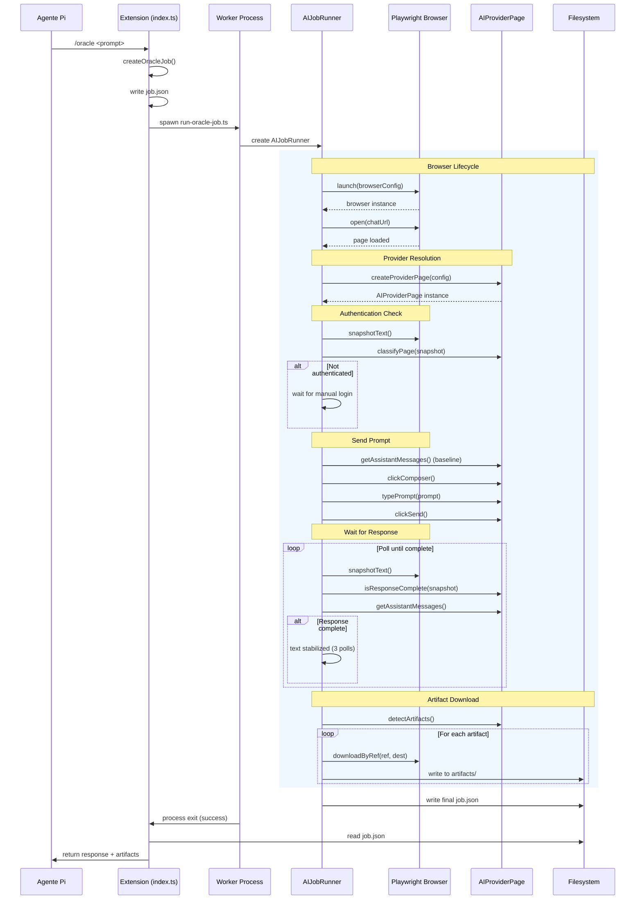
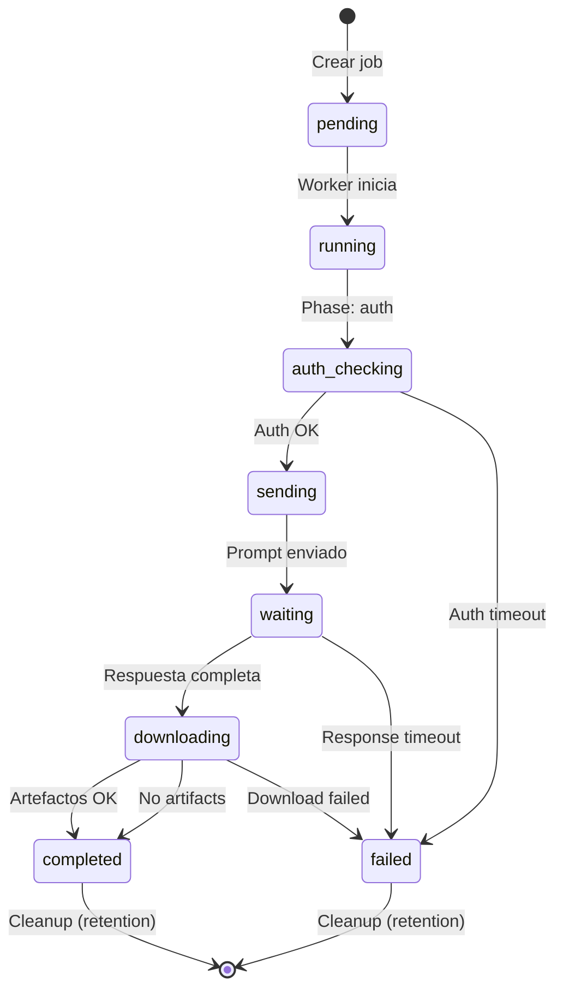

# Arquitectura de pi-oracle

## Visión General

Pi-oracle es una extensión para el agente de codificación **pi** que automatiza interacciones con proveedores de IA (ChatGPT, y futuramente Claude, Gemini, etc.) mediante Playwright. Su arquitectura sigue el principio de **Dependency Inversion**: las capas superiores (worker, jobs) dependen de abstracciones (`AIProviderPage`), no de implementaciones concretas (`ChatGPTPage`).

## Capas de Arquitectura

```
┌─────────────────────────────────────────────┐
│              Extension Entry                │
│              index.ts                       │
│  Registra comandos, tools, pollers en pi   │
└──────────────────┬──────────────────────────┘
                   │
┌──────────────────▼──────────────────────────┐
│              Worker Layer                   │
│              worker/run-oracle-job.ts       │
│  Proceso aislado que ejecuta jobs          │
│  Usa createProviderPage() (factory)        │
└──────────────────┬──────────────────────────┘
                   │
┌──────────────────▼──────────────────────────┐
│              Job Runner                     │
│              lib/ai-job-runner.ts           │
│  Orquestación: launch → auth → send → wait │
│  Delega a ArtifactDownloader, ModelConfig  │
└──────────────────┬──────────────────────────┘
                   │
┌──────────────────▼──────────────────────────┐
│         Provider Abstraction                │
│         pages/ai-provider.types.ts          │
│  Interfaz AIProviderPage (contrato)        │
│  Factory: createProviderPage()             │
└──────────────────┬──────────────────────────┘
                   │
        ┌──────────┴──────────┐
        ▼                     ▼
┌───────────────┐    ┌───────────────┐
│  ChatGPT      │    │  Claude       │
│  Provider     │    │  (futuro)     │
│               │    │               │
│  pages/       │    │  pages/       │
│  chatgpt/     │    │  claude/      │
│  .selectors   │    │  .selectors   │
│  .actions     │    │  .actions     │
│  .assertions  │    │  .assertions  │
│  .page        │    │  .page        │
└───────────────┘    └───────────────┘
```

## Flujo de Datos Completo



## Estructura del Código

```
extensions/oracle/
├── index.ts                      # Entry point de la extensión
│                                  # - Registra comandos (/oracle, /oracle-auth, etc.)
│                                  # - Registra tools (oracle_submit, oracle_read, oracle_cancel)
│                                  # - Inicia el poller de jobs
│
├── lib/                          # Capa de infraestructura
│   ├── ai-job-runner.ts          # Orquestador del ciclo de vida del job
│   │                             # Clases: AIJobRunner
│   │                             # Métodos públicos: launchBrowser, verifyAuth, 
│   │                             #   sendPrompt, waitForChatCompletion, downloadArtifacts
│   │
│   ├── browser-detection.ts      # Detección auto de navegador (4 capas)
│   │                             # Funciones: resolveBrowserPath(), detectBrowserVersion()
│   │                             # Soporta: Brave, Chrome, Edge, Chromium
│   │                             # Plataformas: macOS, Linux, Windows
│   │
│   ├── browser.ts                # Lanzamiento y configuración del browser
│   │                             # Wrapper de Playwright con gestión de sesiones
│   │                             # Funciones: launch, close, open, snapshotText, etc.
│   │
│   ├── commands.ts               # Registro de comandos CLI
│   │                             # /oracle <solicitud> — Crea y ejecuta job
│   │                             # /oracle-auth — Bootstrap de autenticación
│   │                             # /oracle-status [job-id] — Estado del job
│   │                             # /oracle-cancel [job-id] — Cancela un job
│   │                             # /oracle-clean <job-id|all> — Limpia artefactos
│   │
│   ├── config.ts                 # OracleConfig y validación
│   │                             # Interfaz: OracleConfig (completa)
│   │                             # Funciones: loadOracleConfig
│   │                             # DEFAULT_CONFIG con valores computados
│   │
│   ├── constants.ts              # Constantes nombradas (timeouts, etc.)
│   │                             # Todas terminan con unidad: _MS, _ATTEMPTS
│   │
│   ├── cookie-paths.ts           # Rutas de cookies por plataforma
│   │                             # Funciones: detectBrowserDataDir()
│   │                             # Soporta: Brave, Chrome, Edge, Flatpak
│   │
│   ├── cookies.ts                # Lectura y filtrado de cookies
│   │                             # Usa sweet-cookie para descifrado
│   │                             # Funciones: readChatGPTCookies, filterImportableAuthCookies
│   │
│   ├── jobs.ts                   # Definición de OracleJob
│   │                             # State machine del job
│   │                             # Funciones: create, read, update, prune
│   │
│   ├── locks.ts                  # Exclusión mutua por conversación
│   │                             # Previene jobs concurrentes en misma conversación
│   │                             # File-based locks con polling
│   │
│   ├── poller.ts                 # Polling de estado para jobs
│   │                             # Poll periódico del filesystem
│   │                             # Detecta completados, fallidos, zombies
│   │
│   ├── runtime.ts                # Configuración de runtime del agente
│   │
│   └── tools.ts                  # Tools del agente (oracle_submit, etc.)
│                                 # Herramientas que el agente pi puede usar
│                                 # oracle_submit: enviar un trabajo
│                                 # oracle_read: leer resultado
│                                 # oracle_cancel: cancelar trabajo
│
├── pages/                        # Capa de Page Objects (POM)
│   ├── ai-provider.types.ts      # Interfaz AIProviderPage (contrato)
│   │                             # Tipos: AIProviderPage, AIProviderConfig, 
│   │                             #   AIProviderResult, ClassifyParams, 
│   │                             #   ClassifyResult, WaitOpts
│   │
│   ├── base.page.ts              # Clase base abstracta para POM
│   │                             # Método: parseSnapshot, findEntry, filterByKind
│   │
│   ├── browser-actions.types.ts  # Interfaz BrowserActions
│   │                             # snapshotText, pageText, evaluate, 
│   │                             # clickRef, fill, type, press, screenshot
│   │
│   ├── provider-factory.ts       # Factory pattern para proveedores
│   │                             # Funciones: registerProvider(), createProviderPage()
│   │                             # Registry: Map<string, factory>
│   │
│   └── chatgpt/                  # ChatGPT - implementación concreta
│       ├── chatgpt.selectors.ts  # Selectores CSS/data-testid/labels
│       │                         # CHATGPT_TESTIDS, CHATGPT_SEMANTIC_SELECTORS, 
│       │                         # CHATGPT_SELECTORS, CHATGPT_LABELS
│       │
│       ├── chatgpt.actions.ts    # Funciones puras de acción
│       │                         # sendPrompt, waitForStreamingToFinish, 
│       │                         # clickNewChat, selectModel
│       │
│       ├── chatgpt.assertions.ts # Funciones puras de aserción
│       │                         # isResponseComplete, isStreamingActive, 
│       │                         # hasComposer, findArtifactCandidates
│       │
│       ├── chatgpt.page.ts       # Page Object principal
│       │                         # Implementa AIProviderPage
│       │                         # Delega a actions/assertions/selectors
│       │
│       ├── chatgpt-auth.selectors.ts  # Selectores para página de login
│       ├── chatgpt-auth.actions.ts    # Actions para página de login
│       ├── chatgpt-auth.assertions.ts # Assertions para página de login
│       └── chatgpt-auth.page.ts       # AuthPage para ChatGPT
│
├── shared/                       # Utilidades compartidas
│   ├── login-utils.ts            # Clasificación de páginas de login
│   │                             # Funciones: classifyChatPage, classifyClaudePage
│   │
│   ├── login-probe-types.ts      # Tipado para login probe
│   │
│   ├── snapshot-utils.ts         # Parser de snapshots de accesibilidad
│   │                             # @pure functions: parseSnapshotEntries, 
│   │                             #   findEntry, findLabeledEntry, filterByKind
│   │
│   └── spawn-utils.ts            # Utilidades para spawn de procesos
│
└── worker/                       # Procesos aislados
    ├── run-oracle-job.ts         # Entry point del worker
    │                             # Parsea args, crea AIJobRunner, ejecuta, escribe resultado
    │
    ├── auth-bootstrap.ts         # Bootstrap de autenticación
    │                             # Lee cookies del navegador real
    │                             # Inyecta en perfil aislado
    │
    └── auth-cookie-policy.ts     # Política de cookies (re-export)
                                  # Re-exporta desde lib/cookies.ts
```

## Módulos Clave — Deep Dive

### `lib/ai-job-runner.ts`

**Responsabilidad:** Orquesta el ciclo de vida completo de un job.

**Flujo interno:**
```
launchBrowser() → verifyAuth() → sendPrompt() → waitForChatCompletion() → downloadArtifacts()
```

**Métodos públicos:**
- `launchBrowser(url)` — Lanza el navegador con configuración aislada
- `verifyAuth()` — Verifica estado de autenticación
- `sendPrompt(prompt)` — Envía prompt al provider (click composer → type → send)
- `waitForChatCompletion(baselineCount)` — Polling con doble verificación (texto + snapshot)
- `downloadArtifacts(responseIndex)` — Detecta y descarga archivos generados

**Métodos clave internos:**
- `assistantSnapshotSlice(snapshot, responseIndex)` — Extrae slice de snapshot correspondiente a una respuesta específica
- `collectArtifactCandidates(responseIndex)` — Busca botones/links con apariencia de archivo
- `waitForStableArtifactCandidates(responseIndex)` — Polling estabilizado para detectar artifacts
- `waitForStableChatUrl(previousUrl)` — Espera a que la URL de chat stabilice

**Dependencias de capa inferior:**
- `lib/browser.ts` — Acciones de navegador
- `pages/ai-provider.types.ts` — Interfaz AIProviderPage
- `pages/chatgpt/chatgpt.selectors.ts` — Labels para model/effort
- `shared/snapshot-utils.ts` — Parser de snapshots

### `lib/browser-detection.ts`

**Responsabilidad:** Detectar el ejecutable del navegador de forma multiplataforma.

**Estrategia de 4 capas:**

| Capa | Fuente | Ejemplo de resolución |
|------|--------|----------------------|
| 1 | Config explícita | `config.browser.executablePath` |
| 2 | Variable de entorno | `BROWSER_PATH`, `ORACLE_BROWSER_PATH` |
| 3 | Auto-detección por plataforma | macOS: `/Applications/Brave Browser.app/...` |
| 4 | Fallback (Chromium bundled) | Playwright chromium install |

**Algoritmo de preferencia de navegador (capa 3):**
```
Brave (preferido) → Chrome → Edge → Chromium
```

**Plataformas soportadas:**
- **macOS:** Busca en `/Applications/` con paths de `.app/Contents/MacOS/`
- **Linux:** Busca en `/usr/bin/`, `/snap/bin/`, rutas de Flatpak
- **Windows:** Busca en `Program Files` con paths de `.exe`

### `lib/config.ts`

**Responsabilidad:** Cargar, validar y mergear la configuración.

**Pipeline de configuración:**
```
DEFAULT_CONFIG → deepMerge(globalConfig) → deepMerge(projectConfig) → validateOracleConfig()
```

**Jerarquía de validación:**
1. **Tipo** (string, number, boolean, array)
2. **Rango** (enteros positivos, límites superior/inferior)
3. **Enum** (valores permitidos: modelFamily, effort, runMode, cloneStrategy)
4. **Seguridad** (paths no deben apuntar a directorios del navegador real)
5. **Consistencia** (modelFamily=pro requiere effort en PRO_EFFORTS)

**Configuración de proyecto limitada:** Solo `defaults`, `worker`, `poller`, `artifacts`, `cleanup` pueden ser sobrescritos a nivel de proyecto. `browser.executablePath` está prohibido por seguridad.

### `shared/snapshot-utils.ts`

**Responsabilidad:** Parsear y consultar snapshots de accesibilidad de Playwright.

**Todas las funciones son `@pure`:**
- No tienen efectos secundarios
- Resultado depende únicamente del input
- Testeables sin mocks ni navegador

**Formato de snapshot:**
```
heading "ChatGPT said:" ref=e456
- button "Copy response" ref=e457
- button "Good response" ref=e458
- textbox "Message..." ref=e459 :placeholder Message ChatGPT
- link "download.json" ref=e460 href="/artifacts/..."
```

**Funciones exportadas:**
| Función | Complejidad | Uso |
|---------|------------|-----|
| `parseSnapshotEntries(snapshot)` | O(n) | Parsea → array de ParsedSnapshotEntry |
| `findEntry(snapshot, predicate)` | O(n) | Primera coincidencia |
| `findLastEntry(snapshot, predicate)` | O(n) | Última coincidencia (búsqueda reversa) |
| `findLabeledEntry(entries, kind, labels)` | O(n) | Busca por kind + label multilingüe |
| `filterByKind(entries, kind)` | O(n) | Filtra por tipo de elemento |
| `filterByLabel(entries, labels)` | O(n) | Filtra por labels candidatos |
| `enabledEntries(entries)` | O(n) | Solo elementos con disabled=false |
| `findButtons(snapshot)` | O(n) | Atajo: filterByKind("button") |
| `findLinks(snapshot)` | O(n) | Atajo: filterByKind("link") |
| `findTextboxes(snapshot)` | O(n) | Atajo: filterByKind("textbox") |
| `labelMatches(actual, candidates)` | O(n·m) | Match case-insensitive substring |

### `lib/locks.ts`

**Responsabilidad:** Exclusión mutua por conversación.

**Motivación:** ChatGPT no permite múltiples conexiones simultáneas a la misma conversación. Los locks previenen:
- Dos jobs enviando prompts a la misma conversación
- Corrupción de estado del chat

**Mecanismo:**
```
File-based lock en /tmp/oracle-{job-id}/.lock
- acquireLock: intenta crear archivo (exclusión por O_CREAT|O_EXCL)
- poll cada LOCK_RETRY_POLL_MS (200ms)
- timeout después de LOCK_ACQUIRE_TIMEOUT_MS (30s)
- release al completar job o en finally block
```

### `lib/poller.ts`

**Responsabilidad:** Poll periódico del filesystem para detectar cambios en jobs.

**Cómo funciona:**
1. Escanea `/tmp/oracle-*/job.json` cada `poller.intervalMs`
2. Detecta estados: `pending`, `running`, `completed`, `failed`
3. Para jobs completados: lee resultado, notifica al agente pi
4. Para jobs zombie (sin heartbeat): marca como failed

## Patrones de Diseño

### Page Object Model (POM)

Cada proveedor de IA tiene **4 archivos** separados por responsabilidad:

| Archivo | Responsabilidad | Ejemplo | Por qué separado |
|---------|----------------|---------|-----------------|
| `.selectors.ts` | Selectores CSS, `data-testid`, labels (fuente única) | `chatgpt.selectors.ts` | Cambiados con cada UI redesign |
| `.actions.ts` | Funciones puras de acción (reciben `BrowserActions`) | `chatgpt.actions.ts` | Testeables con mocks |
| `.assertions.ts` | Funciones puras de aserción (reciben snapshot string) | `chatgpt.assertions.ts` | 100% testeables sin navegador |
| `.page.ts` | Page Object principal (extiende `BasePage`, delega) | `chatgpt.page.ts` | Orquestador |

**La separación permite:**
- Testear actions y assertions de forma unitaria (sin navegador)
- Reutilizar funciones puras fuera del contexto de page
- Mantener selectores como fuente única de verdad

### Factory Pattern + Registry

**Implementación en `provider-factory.ts`:**

```typescript
// Registry interno (vacío al inicio, se llena con registerProvider)
const PROVIDER_REGISTRY: Map<string, (config: AIProviderConfig) => AIProviderPage> = new Map([]);

// Estrategia de resolución:
// 1. URL exacta (https://chatgpt.com → ChatGPTPage)
// 2. Dominio (chatgpt.com → ChatGPTPage)
// 3. Default: ChatGPTPage como fallback
```

**Por qué un registry vacío:** ChatGPT es el default. Otros proveedores se registran vía `registerProvider(url, factory)` cuando se implementan. Esto permite el diseño de "plugin" — no necesitas modificar la factory para agregar nuevos proveedores.

### Dependency Inversion

```
Extension ──► Worker ──► AIJobRunner ──► AIProviderPage (abstracción)
                                                      ▲
                                                      │
                                         ChatGPTPage  │  ClaudePage  │  GeminiPage
                                         (concreta)   │  (concreta)  │  (concreta)
```

**Regla de oro:** Las capas NUNCA importan implementaciones concretas de proveedor directamente. Solo `provider-factory.ts` conoce los concretos.

### Strategy Pattern

1. **Detección de browser:** 4 capas con fallback (config → env → auto → bundled)
2. **Clasificación de página:** varía por proveedor (`classifyChatGPTPage`, `classifyClaudePage`)
3. **Estrategia de envío:** Enter-first (evita buscar botones "camaleónicos")

### Snapshot-based Detection

**¿Por qué snapshots y no DOM directo?**

| Aspecto | DOM (querySelector) | Snapshot (accessibility tree) |
|---------|-------------------|-------------------------------|
| Estabilidad UI | ❌ Cambia con cada deploy | ✅ Basado en roles ARIA |
| Multilingüe | ❌ Requiere texto exacto | ✅ Labels ya están traducidos |
| Testing | ❌ Requiere navegador | ✅ String puro, 100% unitario |
| Legibilidad | Medio | ✅ Código casi self-documenting |

**Ejemplo:**
```typescript
// ❌ DOM approach — frágil
const button = await page.locator('[data-testid="send-button"]').click();

// ✅ Snapshot approach — estable
const snapshot = await browser.snapshotText();
const entry = findLabeledEntry(parseSnapshotEntries(snapshot), "button", LABELS.send);
```

## Convenciones

### Selectores

**Jerarquía de preferencia:**

```
data-testid ──► aria-label ──► data-message-author-role ──► IDs estructurales ──► CSS classes (NUNCA)
```

**NUNCA depender de:**
- Clases CSS de Tailwind (cambian con cada deploy de ChatGPT)
- Text labels traducibles como estrategia primaria (mantener como `@deprecated` fallback)
- Estructura DOM específica (niveles de nesting, orden de elementos)

### Imports

- **Estáticos** al inicio del archivo (nunca `await import()` dinámico ni `require()`)
- Tipos con `import type { ... }` cuando solo se necesitan como tipos
- Rutas relativas con extensión `.ts` (ESM, no `.js`)

### Nombres

| Elemento | Convención | Ejemplo |
|----------|-----------|---------|
| Constantes | `SCREAMING_SNAKE_CASE` con unidades | `RESPONSE_POLL_INTERVAL_MS` |
| Variables | `camelCase` | `completedResponse` |
| Funciones puras | `camelCase` + `@pure` en JSDoc | `parseSnapshotEntries()` |
| Clases | PascalCase | `AIJobRunner`, `ChatGPTPage` |
| Archivos | `kebab-case` | `ai-job-runner.ts` |
| Interfaces | PascalCase con `I` optional | `AIProviderPage`, `BrowserActions` |
| Tipos | PascalCase | `PageState`, `OracleModelFamily` |

### Funciones Puras

**¿Qué hace a una función `@pure`?**

1. **Sin mutación:** No modifica argumentos ni estado global
2. **Sin I/O:** No lee archivos, no hace fetch, no spawn procesos
3. **Sin estado:** No depende de variables externas
4. **Determinística:** Misma entrada → misma salida siempre

**Ventajas:**
- Test trivial: `expect(fn(input)).toBe(expected)`
- No necesita mocks
- Cacheable si se desea
- Composición libre: `fn2(fn1(input))`

## Comunicación entre Procesos

### Arquitectura de Worker

```
Extension (proceso pi)                    Worker (proceso hijo)
┌─────────────────────┐                   ┌─────────────────────┐
│ registerCommand()   │                   │ main() {            │
│ registerTool()      │    spawn()        │   const runner =    │
│ startPoller()       │ ──────────────►   │     new AIJobRunner()│
│                     │                   │   runner.run()       │
│ poller loop ◄───────┼────────────────── │   write job.json    │
│ lee job.json        │   exit code ◄─────┤   process.exit(code)│
└─────────────────────┘                   └─────────────────────┘
```

### Protocolo de Filesystem

```
/tmp/oracle-{job-id}/
├── job.json          # Estado del job (config, progreso, resultado)
│                     # Campos: id, status, phase, chatUrl, 
│                     #   responseText, artifacts, error
│
├── heartbeat.json    # Heartbeat periódico para detectar jobs zombies
│                     # Campo: lastSeen (ISO timestamp)
│
├── artifacts/        # Archivos descargados del proveedor de IA
│   ├── script.py
│   ├── report.pdf
│   └── artifacts.json  # Manifest con displayName, fileName, sha256
│
└── logs/             # Logs de diagnóstico (en caso de error)
    ├── error.snapshot.txt
    ├── error.url.txt
    └── error.body.txt
```

### Estado del Job (State Machine)



## Flujo de un Job Detallado

### Fase 1: Inicialización
```
1. Agent pi ejecuta /oracle "revisa tests/unit/snapshot-utils.test.ts"
2. Extension:
   a. Lee configuración con loadOracleConfig(cwd)
   b. Genera job-id (hash del prompt)
   c. Crea OracleJob con estado "pending"
   d. Escribe job.json en /tmp/oracle-{id}/
3. Extension spawnea: node worker/run-oracle-job.ts {job-id}
```

### Fase 2: Ejecución del Worker
```
4. Worker (run-oracle-job.ts):
   a. Lee job.json
   b. Crea AIJobRunner con provider via factory
   c. Actualiza estado a "running"
   
5. AIJobRunner.launchBrowser():
   a. Detecta navegador (browser-detection.ts)
   b. Lanza Playwright con userDataDir aislado
   c. Abre chatUrl (ej: https://chatgpt.com)
   
6. Auth check:
   a. Toma snapshot de la página
   b. classifyPage() → "authenticated_and_ready"
   c. Si "login_required" → espera login manual
```

### Fase 3: Envío del Prompt
```
7. AIJobRunner.sendPrompt():
   a. getAssistantMessages() → baseline count (ej: 2 mensajes previos)
   b. clickComposer() → focusea el textarea
   c. typePrompt() → escribe el prompt via JS
   d. clickSend() → presiona Enter
   
8. waitForStableChatUrl():
   a. Poll cada 1000ms
   b. Verifica URL pattern /c/{conversation-id}
   c. Requiere 2 URLs consecutivas iguales
```

### Fase 4: Espera de Respuesta
```
9. waitForChatCompletion(baselineCount=2):
   a. Poll cada 5000ms (config.worker.pollMs)
   b. Por cada poll:
      i.   snapshotText() → verifica "Copy response" sin "Stop streaming"
      ii.  getAssistantMessages()[2] → texto del nuevo mensaje
      iii. Si texto estable (3 polls consecutivos iguales) → DONE
   c. Timeout a 90 minutos (config.worker.completionTimeoutMs)
```

### Fase 5: Descarga de Artefactos
```
10. downloadArtifacts(responseIndex=2):
    a. reopenConversationForArtifacts() → reabre la conversación
    b. waitForStableArtifactCandidates() → poll hasta estable
    c. Para cada candidate (botón/link con label tipo archivo):
       i.   Click con downloadByRef()
       ii.  Calcula sha256
       iii. Escribe en artifacts/
       iv.  Actualiza artifacts.json
    d. Si captura deshabilitada → escribe []
```

### Fase 6: Finalización
```
11. Escribe resultado final en job.json:
    {
      "status": "completed",
      "responseText": "... texto de la respuesta ...",
      "artifacts": [...],
      "chatUrl": "https://chatgpt.com/c/abc123",
      "conversationId": "abc123"
    }
12. process.exit(0)
13. Poller detecta job completado → notifica al agente pi
14. Agente pi lee respuesta y continúa
```

## Extension de Proveedores

**Para agregar un nuevo proveedor (Claude, Gemini, etc.):**

1. Crear los 4 archivos POM en `pages/{provider}/`
2. Registrar en `provider-factory.ts` via `registerProvider(url, factory)`
3. Extender `login-utils.ts` con `classify{Provider}Page()`
4. Crear tests unitarios para assertions

Ver [ADDING-A-PROVIDER.md](ADDING-A-PROVIDER.md) para la guía completa con código de ejemplo.
